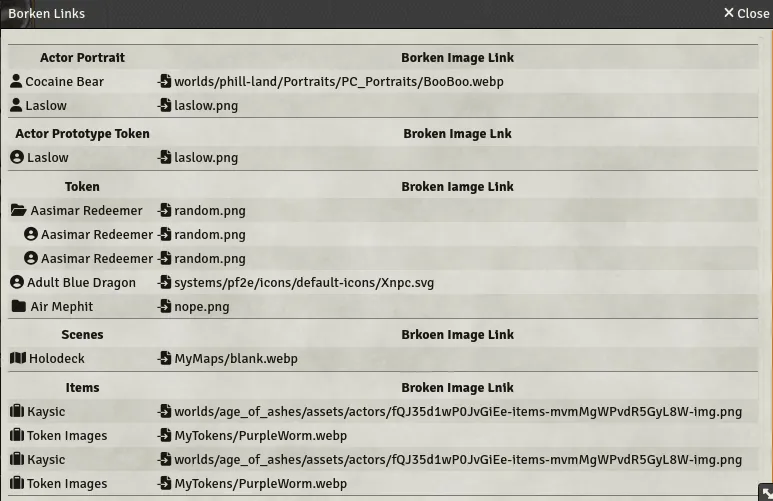

# Foundry VTT Broken Linker Finder/Fixer

These are a couple macros to help with fixing image links.

## Find Borken Links
This will find all broken image links and present a table of them.

Each item in the table's left column can be clicked on to open that item's sheet
(e.g., character sheet for actors, token config for tokens, etc.), where the
links can be changed.  The link in right column can also be clicked on, to
directly open the file browser dialog to change the link.

After to change the link, it will turn green if it exists.  To help keep track
of what you've fixed and what you haven't yet.

If a Token image breaks, it probably breaks the link for every instance of the
token in every scene.  Changing them all one by one is tedious.  To help with
this, token images that came from the same prototype token are all grouped into
a folder.  Clicking the folder will expand it and show all the tokens in it.
Choosing a new link, using the file icon in the right column of the folder's
row, will change the link for every item in the folder at once.

In this example, can see a number of broken links sorted by type.  Actor
Portraits are what you see on the character sheet.  The Prototype Token is what
you get when you drop the actor into a scene.  The Tokens are tokens already in
scenes.

Here, there are several Aasimar Redeemers and Air Mephits, so they are grouped
into folders.  The Assimar folder has been expanded.  Clinking the pick file
icon to the right of the folder will change all the images in it.  While the
links for two specific Aasimar Redeemers in the folder will only change that one
token.

## Image Updater
This macro will find all image links and rename the extension for a different
file type, e.g. png to webp.

You provide a list of extensions, in order of preference, and for every link it
finds, it checks on the server if a new image with one of those extensions
exists.  Only if the image exists with a better (i.e., earlier in the list)
extension does the link get changed.

So you can re-compress a few giant png token images to webp, run the macro, and
it will fix up those tokens, in every scene they appear in, automatically.  And
you don't have to worry about all the images you didn't re-compress getting
changed.

You can control what type of objects (Actors, Tokens, Scenes, etc.) it will
search.  It's also possible to exclude images from the game system or core FVTT
from being changed.

